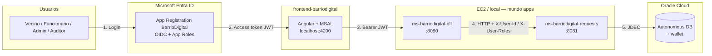
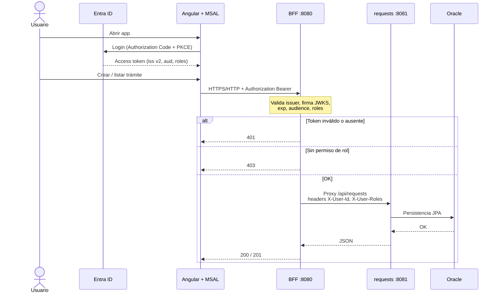

# Arquitectura EP1 — BarrioDigital

Recorte de la **Prueba 1**: login Microsoft + BFF con JWT + trámites en Oracle.  
Lo que viene en EP2 (Gateway, front en S3/Amplify) se marca como “después”.

## Vista en 30 segundos

## Flujo de una petición autenticada

## Qué valida cada capa (EP1)

| Capa | Responsabilidad |
|------|-----------------|
| **Entra ID** | Identidad, App Roles (`Admin`, `Funcionario`, `Vecino`, `Auditor`), emite JWT |
| **Angular + MSAL** | Login/logout, guarda token, manda `Authorization: Bearer` al BFF |
| **BFF** | Resource Server: issuer, audience, firma, `exp`; CORS; proxy a requests; 401/403 |
| **requests** | CRUD trámites; filtra por dueño si es Vecino; **no** valida JWT (confía en headers del BFF) |
| **Oracle** | Tabla de trámites; wallet fuera del repo |

Contrato resumido (detalle en `decisiones.md`):

- Issuer: `https://login.microsoftonline.com/<tenant>/v2.0`
- Audience: GUID del client id y/o `api://<clientId>`
- Roles en claim `roles`
- Scope API: `api://…/access_as_user`

## Qué NO entra en este dibujo (EP2+)

- **API Gateway** delante del BFF (JWT en la nube + evidencias 401/200)
- Front publicado (S3/Amplify) con redirect Entra de producción
- Catalog completo, cambio de estado avanzado, Rabbit/Kafka

En EP1 el front puede pegarle **directo al BFF** (`localhost:8080` o IP EC2). En EP2 apunta al Gateway.

## Despliegue de referencia (lab)

| Pieza | Dónde |
|-------|--------|
| BFF + requests | Docker Compose en EC2 (o local) |
| Oracle | Autonomous en OCI (no en AWS) |
| Wallet | Volumen `/wallet`, no en Git |
| Front EP1 | `ng serve` → `http://localhost:4200` |
