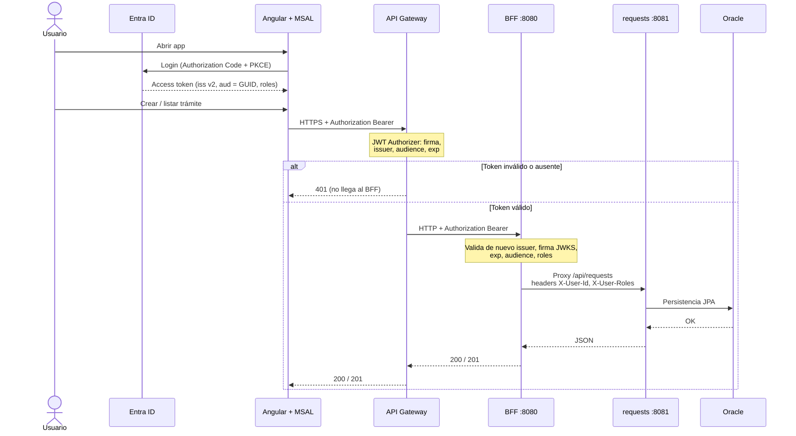

# Arquitectura EP1 — BarrioDigital

Recorte de la **Prueba 1** tal como quedó desplegado: login Microsoft, front en Amplify, API Gateway con JWT Authorizer, BFF y trámites en Oracle.  
Lo que sigue (EP2+) está al final. Las URLs concretas viven en `decisiones.md`.

## Vista en 30 segundos

```mermaid
flowchart LR
  subgraph Usuarios
    V[Vecino / Funcionario / Admin / Auditor]
  end

  subgraph Azure["Microsoft Entra ID"]
    AD[App Registration BarrioDigital<br/>OIDC + App Roles]
  end

  subgraph Front["frontend-barriodigital"]
    ANG[Angular + MSAL<br/>Amplify Hosting]
  end

  subgraph AWS["AWS"]
    GW[API Gateway HTTP API<br/>barriodigital-api<br/>JWT Authorizer]
    subgraph Back["EC2 — mundo apps, Docker Compose"]
      BFF[ms-barriodigital-bff<br/>:8080]
      REQ[ms-barriodigital-requests<br/>:8081]
    end
  end

  subgraph Datos["Oracle Cloud"]
    ORA[(Autonomous DB<br/>+ wallet)]
  end

  V -->|1. Login| AD
  AD -->|2. Access token JWT| ANG
  ANG -->|3. HTTPS + Bearer JWT| GW
  GW -->|4. HTTP + Bearer JWT| BFF
  BFF -->|5. HTTP + X-User-Id / X-User-Roles| REQ
  REQ -->|6. JDBC| ORA
```

En desarrollo local el front corre con `ng serve` en `http://localhost:4200` y le pega directo al BFF (`http://localhost:8080`), sin Gateway.

## Flujo de una petición autenticada

## Qué valida cada capa (EP1)

| Capa | Responsabilidad |
|------|-----------------|
| **Entra ID** | Identidad, App Roles (`Admin`, `Funcionario`, `Vecino`, `Auditor`), emite JWT |
| **Angular + MSAL** | Login/logout, guarda token, manda `Authorization: Bearer` al API Gateway (en local, al BFF) |
| **API Gateway** | JWT Authorizer: firma, issuer, audience (GUID) y `exp`; 401 sin llamar al BFF. Solo enruta las rutas publicadas (`decisiones.md`) |
| **BFF** | Resource Server: vuelve a validar issuer, audience, firma y `exp`; roles → 403 en `/api/admin/**`; CORS; proxy a requests |
| **requests** | CRUD trámites; filtra por dueño si es Vecino; **no** valida JWT (confía en headers del BFF) |
| **Oracle** | Tabla de trámites; wallet fuera del repo |

Contrato resumido (detalle en `decisiones.md`):

- Issuer: `https://login.microsoftonline.com/<tenant>/v2.0`
- Audience: GUID del client id (lo que traen los tokens v2); el BFF acepta además `api://<clientId>`
- Roles en claim `roles`
- Scope API: `api://…/access_as_user`

## Qué NO entra en este dibujo (EP2+)

- Catalog completo, cambio de estado avanzado, Rabbit/Kafka

## Despliegue de referencia (lab)

| Pieza | Dónde |
|-------|--------|
| Front | AWS Amplify Hosting (producción); `ng serve` → `http://localhost:4200` (desarrollo) |
| API Gateway | HTTP API `barriodigital-api` con JWT Authorizer, delante del BFF |
| BFF + requests | Docker Compose en EC2 (`apps/compose.ec2.yml`) o local (`apps/compose.yml`) |
| Oracle | Autonomous en OCI (no en AWS) |
| Wallet | Volumen `/wallet`, no en Git |
